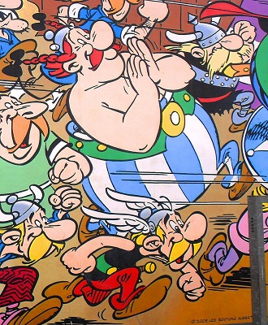

# Asteriks

Asteriks (fr. Astérix) – francuska seria komiksowa stworzona przez René
Goscinnego (scenariusz tomów 1–24) i Alberta Uderzo (rysunki do tomów 1–34;
scenariusz tomów 25–34), kontynuowana przez Jeana-Yves’a Ferriego (scenariusz od
tomu 35.) i Didiera Conrada (rysunki od tomu 35.). Po raz pierwszy postać
Asteriksa pojawiła się w magazynie „Pilote” 29 października 1959.

# Bohaterowie i miejsce akcji

## Główni bohaterowie

- Asteriks – tytułowy bohater jest Galem zamieszkującym niewielką wioskę w
  Galii, wyróżnia się sprytem. Bohaterowi w jego przygodach często towarzyszy
  przyjaciel: Obeliks, ze swym psem Idefiksem. Rodzicami Asteriksa są: Pralina i
  Astronomiks.
- Obeliks – dostawca menhirów, przyjaciel Asteriksa. Kiedy był mały, wpadł do
  kotła z magicznym napojem; dzięki temu posiada nieograniczoną siłę. Od lat
  zakochany w Falbali.
- Panoramiks – druid, a zarazem jedyna osoba, która potrafi przygotować magiczny
  napój, dający nadludzką siłę. Często ratuje bohaterów z opresji.
- Idefiks – pies Obeliksa, nieodłączny towarzysz podróży bohaterów.

## Mieszkańcy osady

- Długowieczniks (fr. Agecanonix; we wcześniejszych zeszytach serii nazywany też
  Ramoliksem) – najstarszy Gal w wiosce, z tego powodu nazywany czasami seniorem
  osady. Urodzony w Gergovii.
- Tenautomatiks (fr. Cétautomatix; we wcześniejszych numerach serii nazywany
  też: Automatiks lub Parabeliks) – Gal, wioskowy kowal. Obok rzemiosła do
  najczęściej przez niego wykonywanych czynności należy narzekanie na świeżość
  ryb Ahigieniksa i uciszanie barda Kakofoniksa.

## Postacie historyczne

- Gajusz Juliusz Cezar – wielki wódz i dożywotni dyktator Rzymu. W pewnym
  stopniu jest głównym wrogiem Asteriksa, choć okazyjnie pomagają sobie
  nawzajem.
- Marek Juniusz Brutus – adoptowany syn Cezara. Główny antagonista w albumie Syn
  Asteriksa.
- Cezarion – syn Juliusza Cezara i Kleopatry.
- królowa Kleopatra – królowa Egiptu i wielka miłość Juliusza Cezara.

## Galijska wioska

Miejscem zamieszkania Asteriksa i jego galijskich przyjaciół jest wioska,
położona w Armoryce (obecnie Bretania na wybrzeżu Oceanu Atlantyckiego) i
otoczona przez cztery warowne obozy rzymskie: Rabarbarum (fr. Babaorum),
Akwarium (fr. Aquarium), Relanium (fr. Laudanum) i Delirium (fr. Petibonum).
Jest to także jedyne miejsce w Galii, opierające się władzy Rzymu po kampanii
Juliusza Cezara.

W jednym z wywiadów Albert Uderzo zasugerował, że inspiracją dla wioski Galów
mogła być miejscowość Erquy, którą regularnie odwiedział w dzieciństwie.
